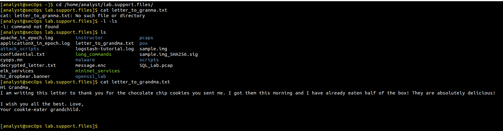
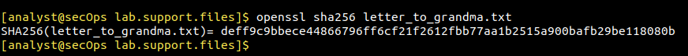
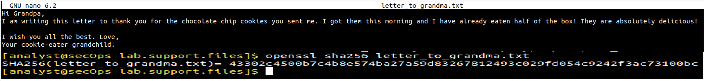
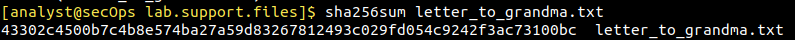
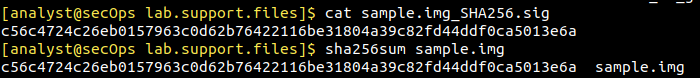

# Laboratorio: Conversión de Elementos en Hashes y Verificación de Integridad (Hashing)

## Descripción General
Práctica de laboratorio orientada al análisis forense digital y la seguridad defensiva, enfocada en comprender cómo operan las funciones criptográficas de resumen (hashing) para garantizar la integridad de los datos en sistemas corporativos e identificar manipulaciones no autorizadas.

## Objetivos del Laboratorio
* Parte 1: Generar y comparar hashes criptográficos utilizando OpenSSL y utilidades del sistema (sha256sum) sobre archivos de texto.
* Parte 2: Simular un incidente de alteración de archivos para comprobar el Efecto Avalancha.
* Parte 3: Validar la integridad de descargas externas comparando firmas oficiales con sumas de comprobación locales.

## Tecnologías y Herramientas Utilizadas
* Sistema Operativo: Máquina virtual Security Workstation (Linux).
* Consola de Comandos: Bash / Terminal de Linux.
* Criptografía: OpenSSL (sha256), sha256sum.
* Edición de Texto: GNU nano.

## Topología / Estructura del Entorno
Entorno de pruebas local aislado en la carpeta de trabajo del analista:
`/home/analyst/lab.support.files/`

## Desarrollo Paso a Paso y Evidencias

### Fase 1: Establecer la Línea Base de Confianza (Lectura del Archivo)
Como primer paso en una auditoría de seguridad o investigación forense, se examina el estado legítimo (baseline) de un activo crítico para conocer su contenido original.

**Comandos ejecutados:**
```bash
cd /home/analyst/lab.support.files/
cat letter_to_granma.txt
```

**Evidencia:**

*Figura 1: Verificación del contenido en texto plano del archivo original.*

---

### Fase 2: Generación del Hash Criptográfico Inicial (SHA-256)
Para asegurar que el archivo no sufra alteraciones futuras sin ser detectado, se calcula su huella digital criptográfica utilizando algoritmos robustos.

**Comandos ejecutados:**
```bash
openssl sha256 letter_to_granma.txt
```

**Evidencia:**

*Figura 2: Generación de la huella digital SHA-256 del archivo.*

---

### Fase 3: Simulación de Incidente y Demostración del Efecto Avalancha
Se simula una modificación no autorizada alterando un solo carácter en el archivo ("Grandma" por "Grandpa"). En ciberseguridad, esto demuestra el Efecto Avalancha: un cambio minúsculo altera de forma radical el hash resultante, permitiendo a los sistemas de monitoreo de integridad (FIM) detectar intrusiones o manipulaciones.

**Comandos ejecutados:**
```bash
nano letter_to_granma.txt
openssl sha256 letter_to_granma.txt
```

**Evidencia:**

*Figura 3: Modificación del archivo en nano y comprobación del nuevo hash SHA-256 completamente diferente.*

---

### Fase 4: Uso de Sumas de Comprobación Nativas (sha256sum)
En entornos operativos diarios, los ingenieros y analistas utilizan utilidades nativas optimizadas para automatizar comprobaciones rápidas de integridad.

**Comandos ejecutados:**
```bash
sha256sum letter_to_granma.txt
```

**Evidencia:**

*Figura 4: Comprobación mediante la herramienta nativa de Linux sha256sum.*

---

### Fase 5: Verificación de Integridad de un Archivo Externo (sample.img)
Antes de desplegar software o imágenes de disco descargadas de la red, es una buena práctica de seguridad verificar que el archivo no haya sido corrupto o interceptado en tránsito (ataques Man-in-the-Middle).

**Comandos ejecutados:**
```bash
cat sample.img_SHA256.sig
sha256sum sample.img
```

**Evidencia:**

*Figura 5: Comparación entre la firma oficial contenida en el archivo .sig y el hash calculado localmente de la imagen.*

---

## Verificaciones Realizadas
1. Se comprobó la correspondencia unívoca entre el contenido y su hash SHA-256.
2. Se verificó que modificar un único carácter rompe por completo el hash anterior (Efecto Avalancha).
3. Se validó con éxito una imagen binaria comparando el hash local con la firma oficial provista por el emisor.

## Conceptos Aprendidos
* Funciones Hash Unidireccionales: Algoritmos matemáticos que generan cadenas de longitud fija imposibles de revertir matemáticamente para obtener el archivo original.
* Integridad: Pilar fundamental de la seguridad de la información que garantiza la detección inmediata de modificaciones maliciosas o accidentales.
* FIM (File Integrity Monitoring): Principio técnico aplicado por herramientas de defensa para vigilar cambios en ficheros del sistema.

## Posibles Mejoras / Buenas Prácticas
* Implementar verificación mediante firmas digitales criptográficas avanzadas con GPG (GNU Privacy Guard) para garantizar no solo la integridad, sino también la autenticidad y el no repudio del emisor.
* Automatizar el monitoreo de directorios críticos utilizando scripts en Bash integrados con herramientas de alerta.

## Conclusión
Este laboratorio demuestra habilidades prácticas esenciales para un analista Junior de Ciberseguridad o SOC, destacando la importancia del manejo de huellas digitales para la validación de artefactos y la detección temprana de anomalías en los sistemas de la organización.
